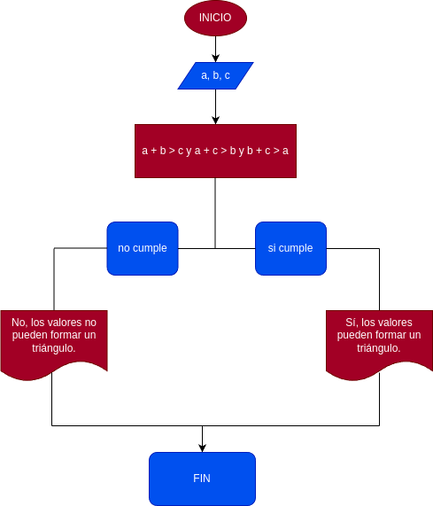

# Quiz instrucciones condicionales

### Realice el análisis, diseño y construcción para resolver el siguiente problema:

Dados tres números a, b y c, correspondientes a la longitud de los lados de una figura geométrica, determinar si pueden formar los lados de un triángulo.

## DISEÑO

Se imprimen los mensajes iniciales.
Se reciben los valores de a, b y c como entrada.
Se verifica si cumplen con las desigualdades triangulares:

𝑎+𝑏>𝑐a+b>c𝑎+𝑐>𝑏a+c>b𝑏+𝑐>𝑎

Si se cumplen todas, se imprime que sí forman un triángulo; si no, se indica que no.

### Diagrama de flujo

